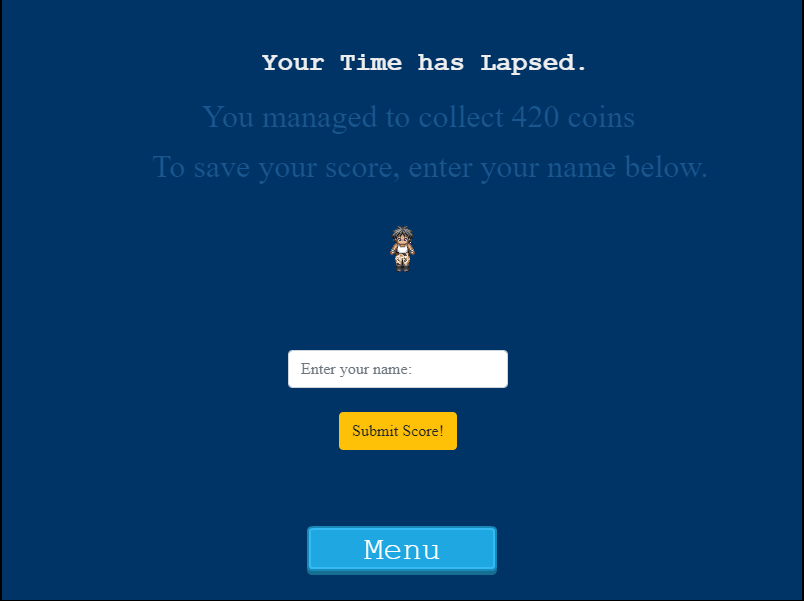

# Javascript Capstone Project

> This game is all about Roshan, the treasure hunter.


## 1. Getting Started: Additional description about the project and its features

This project is configured to be as simple as possible; build, deploy, and play with, all with npm.

## 2. Built With

- [EcmaScript 6.](https://www.w3schools.com/js/js_es6.asp)
- [Chrome web Browser.](https://www.google.com/chrome/?brand=CHBD&gclid=CjwKCAjwqJ_1BRBZEiwAv73uwMy_V_6pha6yTVEa8JtU5T51QdyxZOVnsXlRndK05hSO4bSM6muP5RoC2E4QAvD_BwE&gclsrc=aw.ds)
- [Netlify](https://www.netlify.com/) for deployment.
- [Webpack](https://webpack.js.org/) for bundling files.
- [Phaser 3](https://phaser.io/) - HTML5 framework.
- [Jest](https://jestjs.io/) framework for tests purposes.
- [HTML/DOM](https://www.w3schools.com/js/js_htmldom.asp) - Manipulation for UI.
- [Eslint](https://eslint.org/) for linter checks and style guides.
- [Leaderboard API service](https://www.notion.so/Leaderboard-API-service-24c0c3c116974ac49488d4eb0267ade3) for the scores' leaders board.

## 3. Pre-requisites

- A code editor.
- Chrome Web Browser.
- Have NodeJS installed locally.
- Basic to intermediate JavaScript skills.

**Below are the instructions on how to play the game and also setting it up locally.**

### Build Dependencies 🚧

***The only dependencies are NodeJS & npm. Any NodeJS LTS version will work. Simply clone this repo and run npm install.***

- To get a local copy up and running, follow these simple example steps.

### Setup and installation

```
git clone git@github.com:christianotieno/platform-game.git
```

### Install dependencies

```
npm install
```

### Play The Game 🕹️

Just run `npm run start` and go to `localhost:8080` in your favorite web browser.

### Run linter checks

```
npx eslint .
```

### Run tests

```
npm run test
```

### Deployment

|  APP NAME | BUILD STATUS: |
|   :---:   |    :---:     |
|**Roshan, the treasure hunter** | [](https://app.netlify.com/sites/roshan-the-treasure-hunter/deploys) |

---

## 4. Game Development Guidelines & Timelines

| TIMELINE    |  TODO  |  DESCRIPTION  |    OUTCOME   |  STATUS   |
| :---        | :----: |    :----:     |    :----:    |  :----:   |
| Day 1       | Learn Phaser 3 framework | Obtain leads, knowledge and the syntax necessary for the development of the game.| Understanding the game framework.|&#9745;|
| Day 2       | Game Design | Design the game by defining the topic and objective of the game, the game mechanics, the different entities involved in the game (player, enemies, platforms, levels, etc.), the user interactions and finally the different screens (Phaser scenes) that needs implementation. |  Set objectives for remaining days. |&#9745;|
| Day 3       |Game Development| Game Development following the defined design|  Game Logic             |&#9745;|
| Day 4       |Game Development| Game Development following the defined design|  Game Interface         |&#9745;|
| Day 5       |Game Documentation| Game Documentation following the defined design|  Game Documentation |&#9745;|
---

## 5. Game Scenes & Their Work Descriptions

| SCENES           |                                                                 DESCRIPTION                                                                      |
| :---             |                                                                 :---                                                                             |
| **Boot**         | The first scene that is loaded by Phaser, and it will in turn load the `PreloaderScene`.                                                         |
| **Preloader**    | The second scene that is loaded after the `BootScene`. It displays the progress bar while it loads all of the assets needed for the game.        |
| **Title**        | The title of the game. It displays buttons to start the game, view credits, and modify options. It is loaded immediately after `PreloaderScene`. |
| **aboutGame**    | This scene loads when the player presses play in the `TitleScene`. It displays the instructions for the game and the mission ahead.              |
| **Credits**      | Credits for the game. It gets displayed when the player presses the credits button in the `TitleScene`.                                          |
| **Game**         | Contains the main logic for the game. Loads after the `aboutScene` loads.                                                                        |
| **GameOver**     | Displays the player's scores immediately the game is over and asks user to register their score after which is loads the `LeadersBoardScene`     |
| **LeadersBoard** | Displays the highscores and their owners. It loads immediately after the `GameOverScene`                                                         |
| **Options**      | Contains settings for the players to be able to modify in the game (example: mute audio).                                                        |
---

## 6. Pictorial trips: On more about the feel/look and what the game is all about

| SCENES              | SCREENSHOT |
| :----               |   :----:   |
| `aboutScene`        |            |
| `CreditsScene`      |        |
| `GameOverScene`     |      |
| `LeadersBoardScene` |  |
| `OptionsScene`      |        |
---

## 7. Live Play

[Link to Live Play](https://roshan-the-treasure-hunter.netlify.app/)

---

## 8. Author Section

👤 **Author**

- Github: [christianotieno](https://github.com/christianotieno)
- Twitter: [@iamchrisotieno](https://twitter.com/iamchrisotieno)
- LinkedIn: [Christian Otieno](https://www.linkedin.com/in/christianotieno/)

---

## 9. 🤝 Contributing

Contributions, issues and feature requests are welcome!

Feel free to check the [issues page](https://github.com/ChristianOtieno/platform-game/issues).

---

## 10. Show your support

Give a ⭐️ if you like this project!

---

## 11. Acknowledgments & Credits

- Hat tip to anyone whose code, sprites/assets, ideas/advice, and knowledge was used.

---

### Credits

| Name  | Author | Source |
| :---- | :---- | :---:  |
| [Roshan sprite](https://untamed.wild-refuge.net/images/rpgxp/roshan.png) | sithjester (RMXP Resources) | [untamed.wild-refuge.net](https://untamed.wild-refuge.net/images/rpgxp/) |
| Platforms | phaser site | [phaser.io](https://phaser.io/) |
|Backgoround Music| phaser site | [phaser.io](https://phaser.io/) |
| [Wall of large bricks](https://opengameart.org/content/wall-of-large-bricks) | [Wyris](https://opengameart.org/users/wyris) | [opengameart.org](https://opengameart.org/)|

---

### Inspiration

This game was inspirred by the [endless runner game](https://www.emanueleferonato.com/tag/endless-runner/) (5 parts tutorial). An inspiration was drawn to design a simple but creative game, and implement it using Phaser. Therefore, I did spend some time designing the game before programming it.

---

## 12. 📝 License

This project is [MIT](https://opensource.org/licenses/MIT) licensed.

---
